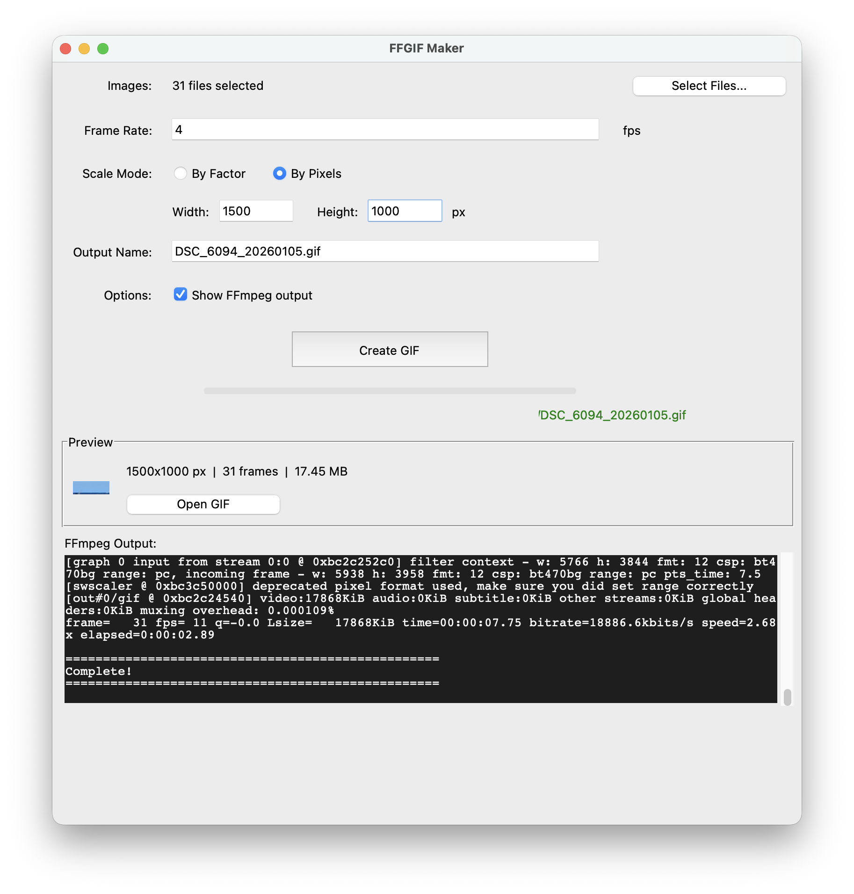

# FFGIF Maker

A simple macOS app for creating high-quality GIFs from image sequences using FFmpeg.



## Features

- **Multi-file selection** - Select images directly, no need to specify folder/extension
- **Smart scaling** - Scale by factor (0.5x) or exact pixel dimensions
- **Auto-naming** - Output filename generated from first image + photo date
- **Live preview** - Animated preview with file size and dimensions
- **High quality** - Two-pass encoding with optimized palette generation
- **Progress tracking** - See encoding progress and optional FFmpeg output

## Installation

### Option 1: Download the App
Download `FFGIF Maker.app` from [Releases](../../releases) and drag to Applications.

### Option 2: Run from Source
```bash
git clone https://github.com/YOUR_USERNAME/FFGIF-Maker.git
cd "FFGIF Maker"
python3 -m venv venv
source venv/bin/activate
pip install Pillow
python FFGIF_Maker.py
```

### Requirements
- **macOS** 10.13+
- **FFmpeg** - Install with `brew install ffmpeg`

## Usage

1. Click **"Select Files..."** and choose your images
2. Set **frame rate** (fps) and **scale**
3. Click **"Create GIF"**
4. Preview appears when complete - click **"Open GIF"** to view full size

See [GUIDE.md](GUIDE.md) for detailed settings reference.

## Building the App

To build a standalone .app bundle:

```bash
source venv/bin/activate
pip install py2app Pillow
python setup.py py2app
```

The app will be created in `dist/FFGIF Maker.app`

## How It Works

FFGIF Maker uses FFmpeg's two-pass encoding for optimal quality:

1. **Pass 1** - Analyzes all frames to generate an optimal 256-color palette
2. **Pass 2** - Creates the GIF using Floyd-Steinberg dithering

This produces significantly better results than single-pass conversion.

## License

MIT License - feel free to use and modify.

## Credits

Built with Python, Tkinter, and FFmpeg.
